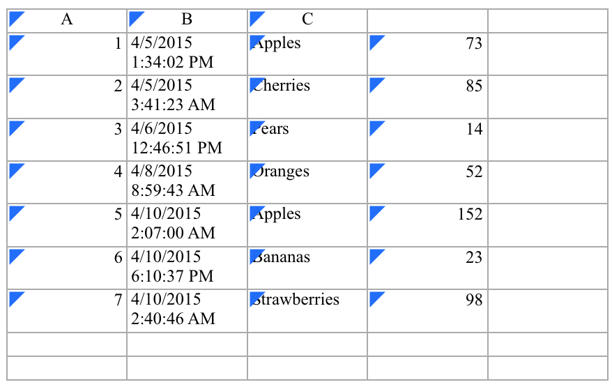

# Usando Python para trabajar con hojas de cálculo

Capítulo original [aqui](https://automatetheboringstuff.com/)

Utilizaremos la librería [openpyxl](https://openpyxl.readthedocs.io/en/stable/)

Lo primero que haremos será instalar openpyxl:

```bash
pip install openpyxl
```

Para probar los códigos a continuación, descárgate el documento [example.xlsx](https://github.com/deleyva/automatiza-tu-aprendizaje/blob/master/example.xlsx?raw=true)

Quedría así:



## Abriendo un archivo excel

```python
>>> from openpyxl import load_workbook
>>> wb2 = load_workbook('test.xlsx')
>>> print wb2.sheetnames
['Sheet2', 'New Title', 'Sheet1']
```

```python
>>> from openpyxl import load_workbook
>>> wb = load_workbook(filename = 'empty_book.xlsx')
>>> sheet_ranges = wb['range names']
>>> print(sheet_ranges['D18'].value)
3
```

## Obteniendo hojas del objeto wb (workbook)

```python
>>> import openpyxl
>>> wb = openpyxl.load_workbook('example.xlsx')
>>> wb.sheetnames
['Sheet1', 'Sheet2', 'Sheet3']
>>> sheet = wb['Sheet3']
>>> sheet
<Worksheet "Sheet3">
>>> type(sheet) <class 'openpyxl.worksheet.worksheet.Worksheet'>
>>> sheet.title
'Sheet3'
>>> anotherSheet = wb.active
>>> anotherSheet
<Worksheet "Sheet1">
```

## Escribiendo una archivo de hojas de cálculo

```python
>>> from openpyxl import Workbook
>>> from openpyxl.compat import range
>>> from openpyxl.utils import get_column_letter
>>>
>>> wb = Workbook()
>>>
>>> dest_filename = 'empty_book.xlsx'
>>>
>>> ws1 = wb.active
>>> ws1.title = "range names"
>>>
>>> for row in range(1, 40):
...     ws1.append(range(600))
>>>
>>> ws2 = wb.create_sheet(title="Pi")
>>>
>>> ws2['F5'] = 3.14
>>>
>>> ws3 = wb.create_sheet(title="Data")
>>> for row in range(10, 20):
...     for col in range(27, 54):
...         _ = ws3.cell(column=col, row=row, value="{0}".format(get_column_letter(col)))
>>> print(ws3['AA10'].value)
AA
>>> wb.save(filename = dest_filename)
```

## Usando formatos de números

```python
>>> import datetime
>>> from openpyxl import Workbook
>>> wb = Workbook()
>>> ws = wb.active
>>> # set date using a Python datetime
>>> ws['A1'] = datetime.datetime(2010, 7, 21)
>>>
>>> ws['A1'].number_format
'yyyy-mm-dd h:mm:ss'
>>> # You can enable type inference on a case-by-case basis
>>> wb.guess_types = True
>>> # set percentage using a string followed by the percent sign
>>> ws['B1'] = '3.14%'
>>> wb.guess_types = False
>>> ws['B1'].value
0.031400000000000004
>>>
>>> ws['B1'].number_format
'0%'
```

## Usando fórmulas

```python
>>> from openpyxl import Workbook
>>> wb = Workbook()
>>> ws = wb.active
>>> # add a simple formula
>>> ws["A1"] = "=SUM(1, 1)"
>>> wb.save("formula.xlsx")
```

>**info**
>
>Debes usar el nombre en inglés para una función y los argumentos de la función deben estar separados por comas y no por otra puntuación, como los puntos y coma.

Openpyxl nunca evalúa la fórmula, pero es posible verificar el nombre de una fórmula:

```python
>>> from openpyxl.utils import FORMULAE
>>> "HEX2DEC" in FORMULAE
True
```

## Combinando y descombinando celdas

```python
>>> from openpyxl.workbook import Workbook
>>>
>>> wb = Workbook()
>>> ws = wb.active
>>>
>>> ws.merge_cells('A2:D2')
>>> ws.unmerge_cells('A2:D2')
>>>
>>> # or equivalently
>>> ws.merge_cells(start_row=2, start_column=1, end_row=4, end_column=4)
>>> ws.unmerge_cells(start_row=2, start_column=1, end_row=4, end_column=4)
```

## Insertando una imagen

```python
>>> from openpyxl import Workbook
>>> from openpyxl.drawing.image import Image
>>>
>>> wb = Workbook()
>>> ws = wb.active
>>> ws['A1'] = 'You should see three logos below'
```

```python
>>> # create an image
>>> img = Image('logo.png')

>>> # add to worksheet and anchor next to cells
>>> ws.add_image(img, 'A1')
>>> wb.save('logo.xlsx')
```

<!--
Ejercicio 17

```python
from openpyxl import Workbook
from openpyxl.compat import range
from openpyxl.utils import get_column_letter
import openpyxl
wb = openpyxl.load_workbook('example.xlsx')
wb.sheets
wb.get_sheet_names
wb.get_sheet_names[0]
wb.get_sheet_names()
wb.sheetnames
sheet = wb.get_sheet_by_name('Hoja1')
sheet
sheet.title
print(sheet[3][2])
print(sheet[3][2].value)
```

-->
