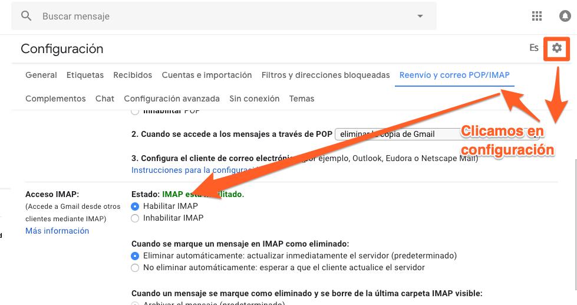

# Enviando y recibiendo mails con python

Artículo orginal [aquí](https://automatetheboringstuff.com/chapter16/)

## Enviando un mail

```python
import smtplib
import getpass
password = getpass.getpass()
user = input('Usuario: ')
destinatario = input('Destinatario: ')
subject = input('Asunto: ')
text = input('Cuerpo del mensaje: ')

message = 'Subject: {}\n\n{}'.format(subject, text)

smtpObj = smtplib.SMTP_SSL('smtp.gmail.com', 465)
smtpObj.ehlo()


smtpObj.login(user, password)
smtpObj.sendmail(user, destinatario, message)
smtpObj.quit()
```

## ¿Qué función práctica puede tener esto?

Mañana veremos una implementación curiosa.

De momento, si quieres saber cómo recibir datos del mail aquí tienes [una prueba](https://github.com/deleyva/automatiza-tu-aprendizaje/blob/master/recibir-mail.py?raw=true).



Activa las aplicaciones de terceros.


## ¿Quieres enviar archivos adjuntos?

[Aquí](https://www.linkedin.com/pulse/python-script-send-email-attachment-using-your-gmail-account-singh/) tienes más información. Y [aquí](https://stackoverflow.com/questions/3362600/how-to-send-email-attachments).

## Recibiendo información del mail

```python
import getpass
from imapclient import IMAPClient


password = getpass.getpass()
user = input('Introduce tu mail')

# context manager ensures the session is cleaned up
with IMAPClient(host="imap.gmail.com") as client:
    client.login(user, password)
    client.select_folder('INBOX')

    # search criteria are passed in a straightforward way
    # (nesting is supported)
    messages = client.search(['NOT', 'DELETED'])

    # fetch selectors are passed as a simple list of strings.
    response = client.fetch(messages, ['FLAGS', 'RFC822.SIZE'])

    # `response` is keyed by message id and contains parsed,
    # converted response items.
    for message_id, data in response.items():
        print('{id}: {size} bytes, flags={flags}'.format(
            id=message_id,
            size=data[b'RFC822.SIZE'],
            flags=data[b'FLAGS']))
```